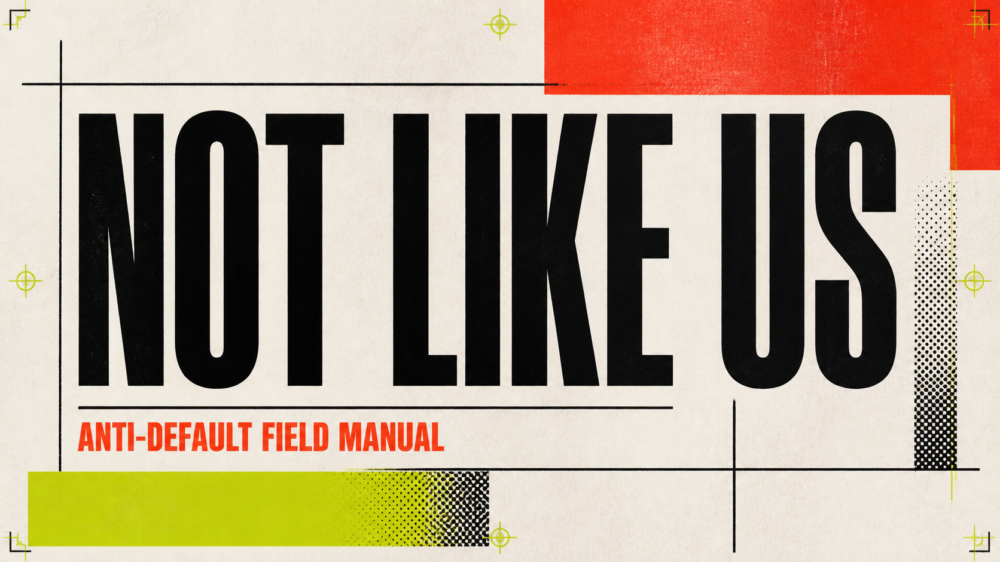

# Not Like Us

An open, cited field manual for making AI-assisted writing and interfaces look like they came from a specific person, product, and situation.

Read it at [notlikeus.adorellc.pro](https://notlikeus.adorellc.pro). Free to fork and use for noncommercial work. If it saved you from another purple gradient, [buy me a coffee](https://buymeacoffee.com/refresh1).

## Two editions

This repository is the **snapshot**. Clone it, install the skill, paste the block. It stays where it was the day you took it.

The [**Stream**](https://notlikeus.adorellc.pro/stream) is the live edition: $4.99 a month, one key, every machine you own. Tool defaults change every few weeks. The Stream delivers each rule change to Claude Code, Codex, Cursor, OpenClaw, Hermes, Gemini CLI, and Copilot as it lands, so your work keeps looking like yours. It also licenses commercial use. Pay by card, Apple Pay, Google Pay, Link, US bank debit, Amazon Pay, or USDC, as a subscription or a one-time pass for 1 to 12 months. Agents can buy a 30-day pass in USDC over x402 without a human at the keyboard. Details and the feed reference are in [stream/README.md](stream/README.md).

```sh
npx github:jtc268/not-like-us sync
```

That command works without a key. It installs the snapshot into every agent on the machine and shows how far behind the Stream it is.

## Install the skill

Paste this into Claude Code, Codex, Cursor, or any agent that installs skills:

```text
Install the /not-like-us skill from https://github.com/jtc268/not-like-us
```

Or use the skills CLI:

```sh
npx skills add jtc268/not-like-us --skill not-like-us --global --yes
```

Then:

```text
/not-like-us review (a draft, page, or component)
/not-like-us build (a brief)
```

## Copy this into any AI

If the tool does not install skills, paste this into its project rules or first message.

```text
Use the Not Like Us rules for every writing and interface decision.
Rules: https://raw.githubusercontent.com/jtc268/not-like-us/main/AGENTS.md

Start from the audience, task, real content, and existing brand. Local design systems and voice guides win.
Reject visual choices the tool supplied without a reason: purple gradients, aurora blobs, glass panels,
rounded cards around everything, Inter or Geist by reflex, centered hero formulas, three equal columns,
decorative pills and icon tiles, fake charts and testimonials, filler imagery, and motion that explains nothing.
Reject empty writing patterns: setup before the point, "not X but Y" slogans, vague consensus, hype adjectives,
rule-of-three filler, synonym cycling, stacked fragments, recap endings, and em dashes.
Use real data and real states. Name a source for every factual claim. Preserve the author's voice.
Never claim that one tell proves AI authorship.
If the work could belong to any product after swapping the logo, make it specific.
```

## What it catches

| Default | Instead |
| --- | --- |
| It's not a chatbot. It's a teammate. | It answers Zendesk tickets and escalates any refund over $200. |
| Experts agree AI content is flooding the web. | Pew sampled 10,000 pages from July 2026. One in ten showed signs of AI writing or editing. |
| In today's fast-paced world, teams need to ship faster than ever. | Delete it. Start with the second sentence. |
| Faster. Smarter. Together. | Code review that took an afternoon now takes twenty minutes. |
| This underscores the importance of testing. | The bug shipped because nobody ran the test. |
| A hero, three benefit cards, a logo strip, testimonials, pricing, and a CTA for a dispatch tool. | The dispatch queue on the first screen, sorted by how late each delivery is. |
| A violet gradient because the brief did not name a color. | Two colors with jobs: one for the brand, one for the destructive action. |
| Every section in a rounded card with a drop shadow. | Rules and spacing. Cards only around things a user picks up and moves. |
| Inter everywhere, chosen because it was available. | Tabular figures for the ledger. A wide sans for wayfinding. A reason for each. |
| A polished happy path. | Loading, empty, error, permission, and long-name states before launch. |

Each rule has a stable ID, an evidence level, and named sources. The full lists are in [the writing rules](manual/rules/WRITING.md) and [the design rules](manual/rules/DESIGN.md).

## Start here

- Agents: [AGENTS.md](AGENTS.md), then the guides for your tool below.
- People: [the writing rules](manual/rules/WRITING.md) and [the design rules](manual/rules/DESIGN.md).
- Systems: [not-like-us.json](manual/not-like-us.json) or [rules.json](manual/data/rules.json).
- Maintainers: [CONTRIBUTING.md](CONTRIBUTING.md) and [the research method](manual/research/METHOD.md).

## Tool guides

| Tool | Writing | Design |
| --- | --- | --- |
| Lovable | [Guide](manual/tools/lovable/WRITING.md) | [Guide](manual/tools/lovable/DESIGN.md) |
| Claude | [Guide](manual/tools/claude/WRITING.md) | [Guide](manual/tools/claude/DESIGN.md) |
| Codex | [Guide](manual/tools/codex/WRITING.md) | [Guide](manual/tools/codex/DESIGN.md) |
| ChatGPT | [Guide](manual/tools/chatgpt/WRITING.md) | [Guide](manual/tools/chatgpt/DESIGN.md) |
| v0 | [Guide](manual/tools/v0/WRITING.md) | [Guide](manual/tools/v0/DESIGN.md) |
| Bolt | [Guide](manual/tools/bolt/WRITING.md) | [Guide](manual/tools/bolt/DESIGN.md) |
| Cursor | [Guide](manual/tools/cursor/WRITING.md) | [Guide](manual/tools/cursor/DESIGN.md) |
| Replit | [Guide](manual/tools/replit/WRITING.md) | [Guide](manual/tools/replit/DESIGN.md) |
| Base44 | [Guide](manual/tools/base44/WRITING.md) | [Guide](manual/tools/base44/DESIGN.md) |
| Gemini | [Guide](manual/tools/gemini/WRITING.md) | [Guide](manual/tools/gemini/DESIGN.md) |
| Gamma | [Guide](manual/tools/gamma/WRITING.md) | [Guide](manual/tools/gamma/DESIGN.md) |

## Limits

This project does not detect AI authorship. A purple gradient, an em dash, or a three-card row proves nothing on its own. Use the catalog to notice clusters of unearned choices and replace them with choices grounded in the actual work.

## How rules are checked

Each rule has a stable ID, scope, source list, and evidence level:

- **Documented:** the product or model provider describes the behavior.
- **Observed:** the pattern repeats in public artifacts or recorded prompt runs.
- **Corroborated:** more than one independent source reports the same pattern.
- **Hypothesis:** useful enough to test, not strong enough to state as fact.

`node manual/scripts/validate.mjs` checks the rule data, checks every cited link against the source ledger, and scans every file for em dashes. `node manual/scripts/research-radar.mjs` fetches each source and records changed hashes in [radar.json](manual/data/radar.json). Run both before changing a rule. A person approves any guidance change.

## License

Everything here is under the [PolyForm Noncommercial License 1.0.0](LICENSE): free to read, fork, and use for personal, educational, nonprofit, and other noncommercial work. Commercial use comes with a [Stream subscription](https://notlikeus.adorellc.pro/stream). Versions before 2026-09-01 were published under MIT and CC BY 4.0, and copies taken under those terms keep them. Product names belong to their owners, and linked sources keep their own licenses.
